<p align="center">
  
</p>

# NetScope

**Network visibility. Diagnostics. Intelligence.**

A local desktop application for monitoring, diagnosing, and understanding network connectivity. Live latency, ping, DNS, traceroute, TCP ports, LAN discovery, SQLite history, and a rule-based session explainer — no account, no API key, no LLM.

[](https://dotnet.microsoft.com/)
[](https://avaloniaui.net/)
[](https://www.sqlite.org/)
[](docs/ARCHITECTURE.md)

## Product overview

Most network checks are scattered across ping, traceroute, a scanner, and a log file. NetScope puts those tools in one desktop window, then keeps optional history locally so a later session can be explained from real measurements.

The engines live in a Core layer with no sockets and no database. Avalonia and the CLI both call the same interfaces. Analysis is a deterministic rule engine in Core — not a language-model API — so results are testable and work offline.

## Core features

| Capability | What it provides |
|---|---|
| **Dashboard** | Active interface, gateway, health, live Down/Up NIC rates, latency chart from the Monitor session. Open Monitor starts probes. |
| **Monitor** | Continuous probes, configurable interval, optional SQLite save, ScottPlot chart and measurement table. |
| **Diagnostics** | Ping, DNS lookup, ICMP traceroute, TCP port tester. |
| **LAN Discovery** | ICMP sweep with hostname and MAC when the ARP cache has them. |
| **History** | Saved sessions, per-session stats, delete one / clear all / drop data older than 30 days. |
| **Analysis** | Offline explanation of a saved run. Trends need at least 8 samples over 2 minutes. |

Dashboard is the latest ping. Analysis is the whole session.

## Product walkthrough

### Live connection health

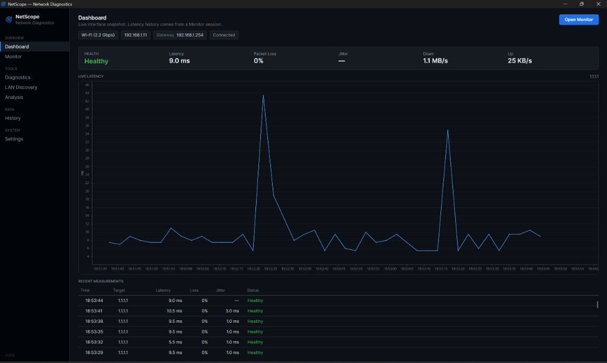

### Continuous monitoring

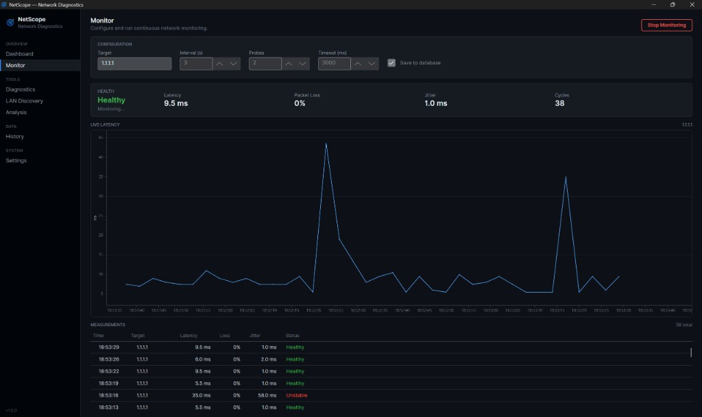

### Diagnostics and discovery

| LAN Discovery | Traceroute |
|---|---|
| 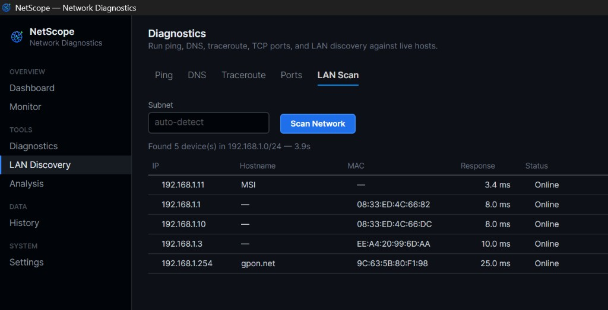 | 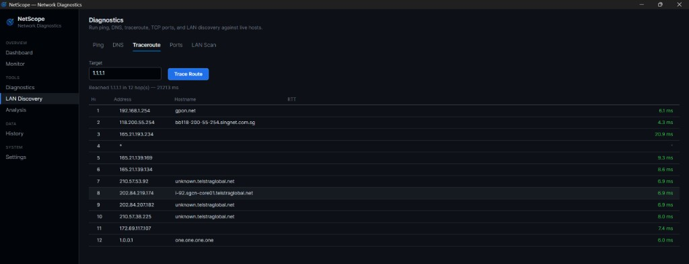 |

| Ping | DNS |
|---|---|
| 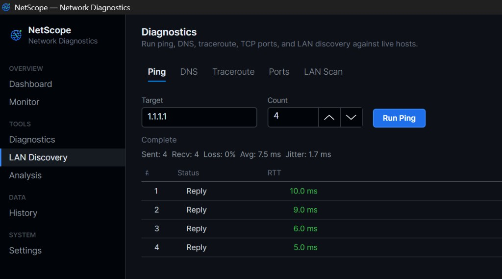 | 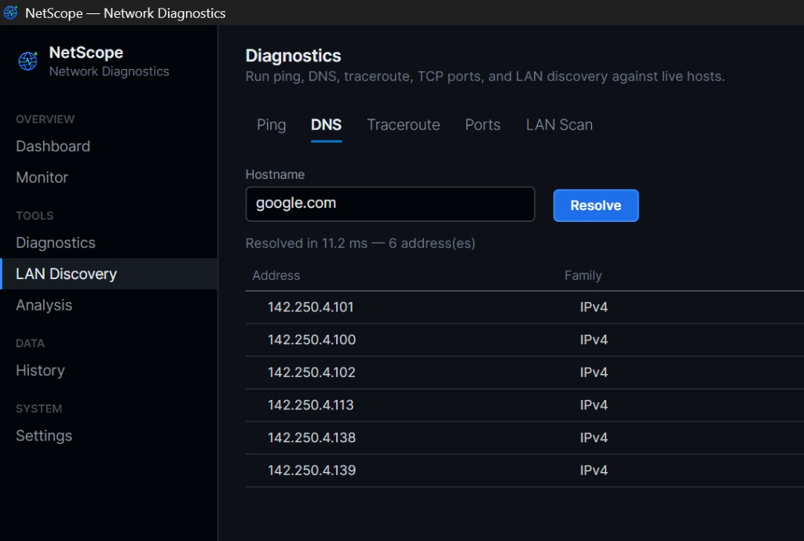 |

| TCP Ports |
|---|
| 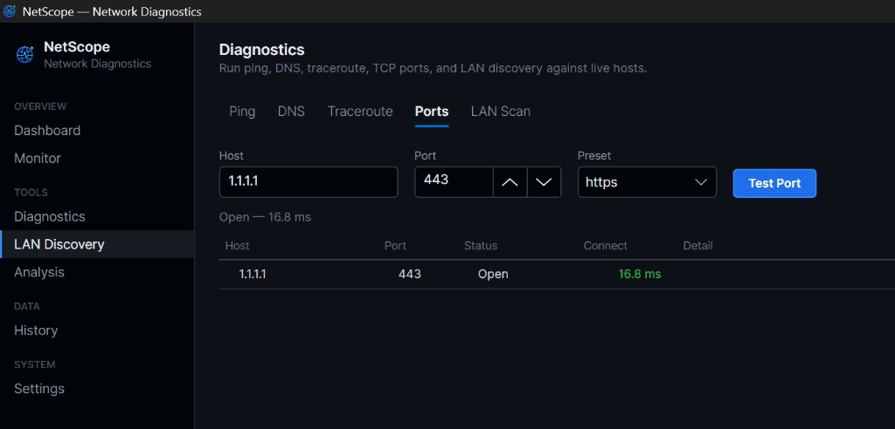 |

### History and explanation

| Saved sessions | Rule-based analysis |
|---|---|
| 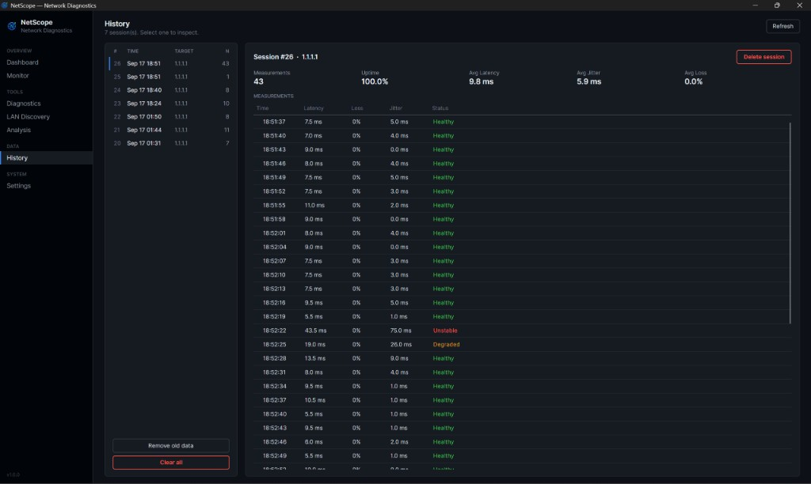 | 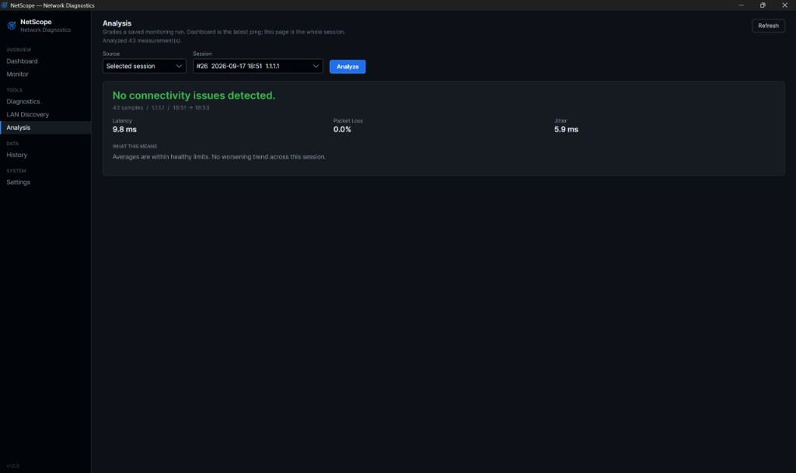 |

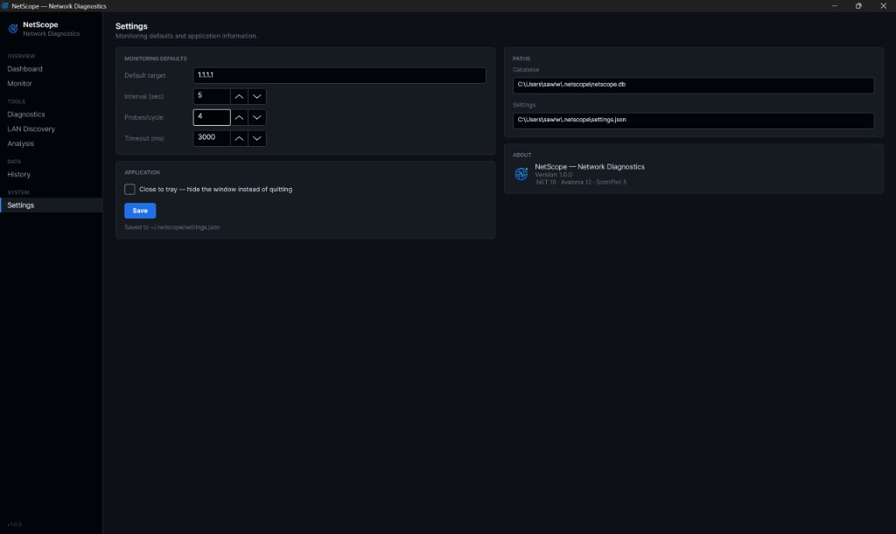

## How it works

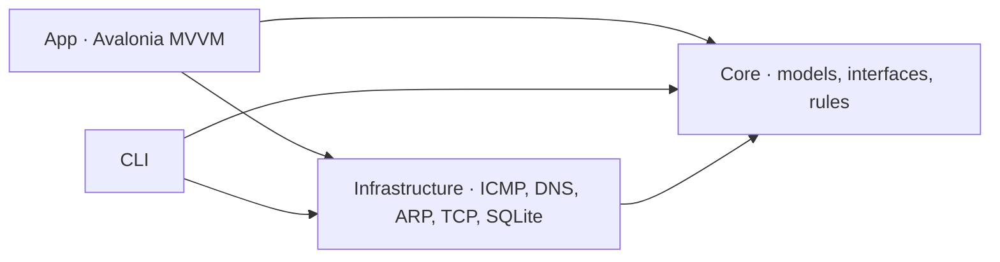

**Core has no sockets and no database.** ViewModels talk to `IPingService`, `IDnsService`, `ITracerouteService`, `IPortTestService`, `INetworkScannerService`, `INetworkMonitorService`, `IMeasurementRepository`, and `IDiagnosticAnalyzer`. `ServiceLocator` is the only place that constructs Infrastructure types.

Layering, data flow, and trust boundaries: [docs/ARCHITECTURE.md](docs/ARCHITECTURE.md).

## Design decisions

| Choice | Why |
|---|---|
| **Rule-based Analysis** | Reproducible in tests, works offline, no API key. A remote narrator can wrap `DiagnosticReport` later. |
| **Clean Architecture** | Same ping/monitor/analyzer for desktop and CLI. UI cannot grow hidden network code. |
| **GitHub Dark** | Dark-only engineering palette. Charts, tables, and chrome are designed for it. |
| **Local SQLite** | Opt-in history in `~/.netscope/netscope.db`. WAL, parameterized SQL, no cloud. |
| **Portable exe + installer** | `scripts/publish-win.ps1` for a self-contained exe; Inno Setup via `scripts/build-installer.ps1`. |
| **Scan bounds** | Explicit CIDR must be `/16` or narrower. Auto-detect clamps wider prefixes to `/24`. |

Health is a pure function (`HealthClassifier`): Healthy / Degraded / Unstable / Disconnected from loss, RTT, and jitter.

## v1.0 scope

**In:** network snapshot, ping, DNS, traceroute, TCP port tester, LAN scan, live monitor, NIC Down/Up rates, SQLite history, rule-based analysis, Avalonia desktop (GitHub Dark, optional close-to-tray), persisted settings, CLI, hardening, Windows portable exe and Inno Setup installer.

**Not in:** LLM assistant, throughput speed-test against a CDN, settings roaming/sync.

## Quick start

```sh
dotnet run --project NetScope.App
```

Windows portable exe (self-contained, no separate .NET install):

```powershell
powershell -File scripts/publish-win.ps1
.\publish\win-x64\NetScope.exe
```

Windows installer (requires [Inno Setup 6](https://jrsoftware.org/isinfo.php)):

```powershell
powershell -File scripts/build-installer.ps1
```

The compiled setup is `installer/output/NetScope-Setup-1.0.0.exe` (gitignored).

CLI:

```sh
dotnet run --project NetScope.Cli -- info
dotnet run --project NetScope.Cli -- ping 1.1.1.1
dotnet run --project NetScope.Cli -- analyze --session 1
dotnet run --project NetScope.Cli -- port 1.1.1.1 --port 443
```

| Command | What it does |
|---|---|
| `info` | Interfaces, connection, public IP |
| `ping` / `dns` / `trace` | Probe a host |
| `port` | TCP connect test (`--port` or `--preset https`) |
| `scan` | LAN ICMP sweep |
| `monitor` | Continuous health (`--save` writes SQLite) |
| `history` / `stats` | Saved sessions |
| `analyze` | Rule-based explanation of saved measurements |

Full flags and engine notes: [docs/ENGINE.md](docs/ENGINE.md).

History lives in `~/.netscope/netscope.db` (`%USERPROFILE%\.netscope\` on Windows). `publish/` is gitignored.

## Build and test

```sh
dotnet build NetScope.slnx
dotnet build NetScope.slnx --configuration Release
dotnet test NetScope.slnx
```

Current version: **1.0.0**.

## Security and privacy

Local diagnostic tool. No account. No API key.

| Topic | Behavior |
|---|---|
| **Data stored** | Optional monitoring history in `~/.netscope/netscope.db`. App settings in `~/.netscope/settings.json`. No cloud sync. |
| **Network** | ICMP, DNS, traceroute, TCP connect, LAN ICMP sweep, public-IP lookup. User-initiated. |
| **Public IP** | ip-api.com (HTTP) with HTTPS fallback to icanhazip.com. 5s timeout. |
| **LAN scan** | `/16` or narrower (~65k hosts max). Auto-detect clamps to `/24`. |
| **SQL** | Parameterized. |
| **Secrets** | None. |

Linux ICMP may need `net.ipv4.ping_group_range` or `CAP_NET_RAW`. Windows ICMP works for a standard user.

## Development phases

- [x] **Phase 1** — Network information
- [x] **Phase 2** — Ping / latency engine
- [x] **Phase 3** — DNS / traceroute
- [x] **Phase 4** — LAN scanner
- [x] **Phase 5** — Monitoring engine
- [x] **Phase 6** — SQLite persistence
- [x] **Phase 7** — Desktop UI (Avalonia)
- [x] **Phase 8** — Rule-based diagnostics
- [x] **Phase 9** — Security, hardening, release readiness
- [x] **Phase 10** — Portfolio presentation

## License

Copyright © 2026 Saw Lwin Htoo. All rights reserved.

This repository is source-visible for portfolio and evaluation purposes. It is **not open source**, and no permission is granted to redistribute, modify, sublicense, sell, or commercially reuse substantial portions of the software without prior written permission. See [LICENSE](LICENSE) for the complete terms.

## Author

**Saw Lwin Htoo (Finn)**

Full-Stack Developer / Software Engineer. NetScope is the desktop counterpart to web work: Clean Architecture, native networking, local persistence, and a cancellable UI.

- GitHub: [@Gooniez3](https://github.com/Gooniez3)
- Related: [StudyMate AI](https://github.com/Gooniez3/studymate-ai)
