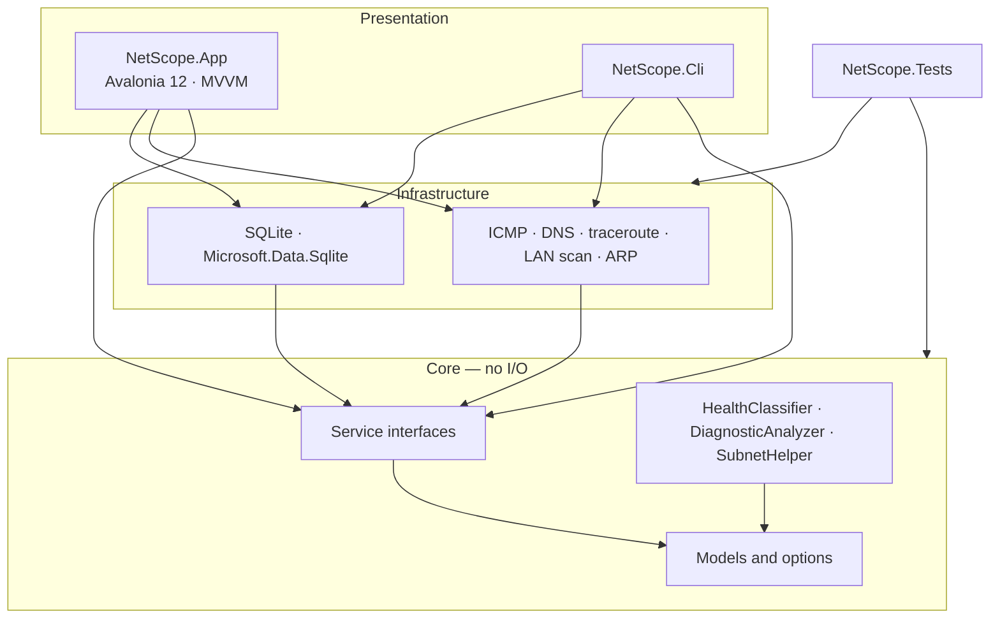

# Architecture

NetScope is a Clean Architecture .NET 10 solution. **Core has no OS or network I/O.** Desktop and CLI are two UIs over the same engines.

## Layers



| Project | Role |
|---|---|
| **NetScope.Core** | Models, option validation, `IPingService` and friends, `HealthClassifier`, `DiagnosticAnalyzer`, `SubnetHelper`. Zero sockets, zero SQLite. |
| **NetScope.Infrastructure** | `System.Net.NetworkInformation.Ping`, `System.Net.Dns`, ICMP traceroute, LAN sweep, ARP table, public-IP HTTP lookup, SQLite repository. |
| **NetScope.App** | Avalonia desktop. ViewModels call Core interfaces. `ServiceLocator` wires implementations. |
| **NetScope.Cli** | Same engines from the console. |
| **NetScope.Tests** | xUnit against Core (pure) and Infrastructure (SQLite, option bounds). |

Dependency rule: **App and CLI may reference Infrastructure. Core must not.**

## Desktop (MVVM)

```
NetScope.App/
├── Services/ServiceLocator.cs   Core interface → Infrastructure
├── ViewModels/                  ObservableObject, no sockets
├── Views/                       Avalonia XAML
├── Styles/AppStyles.axaml       GitHub Dark palette
└── Program.cs                   fatal-exception handlers
```

| ViewModel | Core services |
|---|---|
| Dashboard | `INetworkInterfaceService`, `INetworkMonitorService` |
| Monitor | `INetworkMonitorService`, `IMeasurementRepository` |
| Diagnostics | `IPingService`, `IDnsService`, `ITracerouteService`, `INetworkScannerService` |
| History | `IMeasurementRepository` |
| Analysis | `IMeasurementRepository`, `IDiagnosticAnalyzer` |
| Settings | defaults in memory; DB path from the repository |

Charts use ScottPlot.Avalonia. They plot numbers the ViewModel already has. They do not ping.

## Data flow (monitor + save)

1. UI/CLI builds `MonitorOptions` and calls `Validate()`.
2. `INetworkMonitorService` runs ping cycles, optionally DNS/gateway, then `HealthClassifier.Classify()`.
3. Each cycle yields a `NetworkMeasurement`.
4. If save is on, `IMeasurementRepository` writes a session and rows to `~/.netscope/netscope.db`.
5. Analysis loads those rows into `DiagnosticAnalyzer` (pure). No LLM.

## Analyzer vs dashboard

| Surface | Window |
|---|---|
| **Dashboard** | Latest ping / current connection |
| **Analysis** | Whole saved session (trends need ≥ 8 samples over ≥ 2 minutes) |

## Trust boundaries

- Host/IP strings: length and null-character checks (`HostTarget`).
- LAN scan: prefix `/16`–`/30`; auto-detect clamps wider prefixes to `/24`.
- SQL: parameterized only.
- Public IP: ip-api.com with HTTPS fallback to icanhazip.com; 5s timeout.
- No API keys, no accounts, no cloud sync.

See [ENGINE.md](ENGINE.md) for CLI flags, jitter, health thresholds, and schema.
